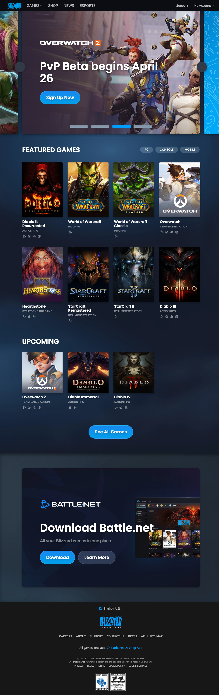

# css-final-project

In class, we were asked to attempt to recreate a website. I chose Blizzard's website because I am an avid WoW fan! I like many different versions of the game so I thought I would put my own twist focused on each expansion instead of the other games. 

I really love the blue design of the website and I think they incorporate some interesting features. First, and maybe the most interesting, each of the images in the grid in the middle of the screen animate into a short video. If possible, I'd like to attempt to do the small segments of gameplay in each expansion, respectively. 

